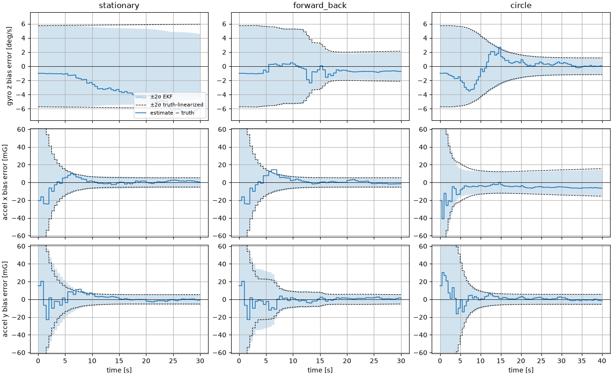
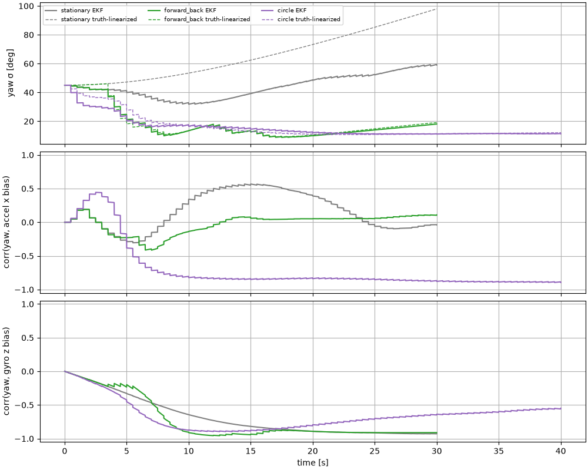
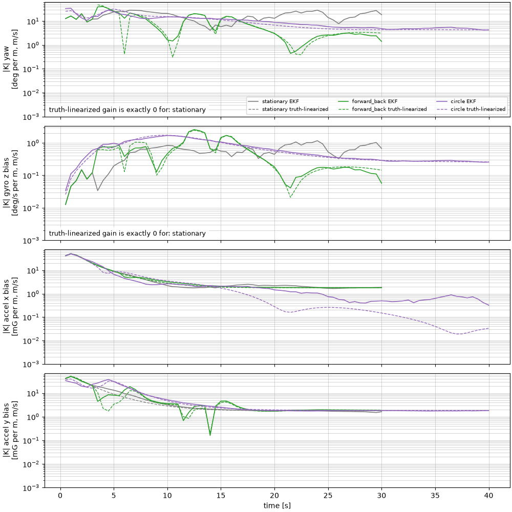

# Bias estimation convergence by scenario

This note looks at how quickly, and whether, the EKF in [`ekf.py`](../ekf.py)
learns the accelerometer and gyro biases in three simulated maneuvers:
standing still, driving 5 m forward and back, and driving in a circle.
GNSS measures only position and velocity, so a bias estimate improves only
when the motion links that bias to something GNSS can see. The analysis
separates two questions:

1. **Can the measurements inform this bias at all?** This is answered with the Kalman gain
   evaluated along the true trajectory ("truth-linearized", §3).
2. **What does the EKF actually do?** The EKF evaluates its Jacobians at
   its own estimates, which can produce gain where there should be none
   (§5).

Everything here is generated by
[`misc/analyze_bias_convergence.py`](../misc/analyze_bias_convergence.py):

```bash
uv run python -m imu_gnss_ekf_training.misc.analyze_bias_convergence            # figures + Monte Carlo table
uv run python -m imu_gnss_ekf_training.misc.analyze_bias_convergence --movies   # also bias movies
```

Bias values are shown in mG (accelerometer) and deg/s (gyro).

## 1. Setup

| item | value |
|---|---|
| scenarios | `stationary` 30 s, `forward_back` 30 s, `circle` 40 s (see the [README](../README.md#simulation-scenarios)) |
| true bias | accel $(0.2, -0.15)$ m/s² ≈ $(20.4, -15.3)$ mG, gyro 1.0 deg/s, **constant** (simulator bias walk off) |
| EKF bias model | initial estimate 0, $\sigma_0$ = 51 mG (accel), 2.86 deg/s (gyro); random walk Q kept at `EkfConfig` defaults |
| sensors | IMU 100 Hz with default noise; GNSS position + velocity every 0.5 s, no dropout |
| runs | seed 7 for the figures; seeds 0–29 for the Monte Carlo table |

To set a different true initial bias in your own runs, use:

```bash
uv run python -m imu_gnss_ekf_training.demo --scenario circle --total-time 40 \
  --initial-accel-bias 0.2 -0.15 --initial-gyro-bias-dps 1.0 --save-log outputs/run/nav_log.npz
```

(`record_sensors.py` has the same options.)

## 2. How GNSS reaches a bias: the gain path

The measurement matrix $H$ selects $[x, y, v_x, v_y]$. A bias state $b$
therefore changes at an update only through its row of the gain,

$$
K_b = P^-_{b,z}\, S^{-1}, \qquad P^-_{b,z} = \operatorname{cov}\!\left(b,\ [x, y, v_x, v_y]\right).
$$

This cross-covariance is zero at start-up. Only the prediction
$F P F^T$ builds it, and only when the dynamics make a bias error visible in
the velocity. Neither `run_filter` nor `NavLog` stores the gain; the script
recomputes it from the logged prior covariance and innovation covariance as
$K = P^- H^T S^{-1}$.

**Which errors show up in the velocity.** Write errors as estimate minus truth
($\delta b = \hat b - b$, $\delta\psi = \hat\psi - \psi$). Let
$\mathbf{a} = [a_x, a_y]^T$ be the true body-frame acceleration and
$J = \begin{bmatrix} 0 & -1 \\ 1 & 0 \end{bmatrix}$. The EKF's navigation-frame
acceleration $R(\hat\psi)(\mathbf{a}^m - \hat{\mathbf{b}}_a)$ then has the error

$$
\delta\mathbf{a}^n \approx R(\psi)\left(J\mathbf{a}\,\delta\psi - \delta\mathbf{b}_a\right),
\qquad \dot{\delta\psi} = -\delta b_g ,
$$

which in body axes reads

$$
e_x = -a_y\,\delta\psi - \delta b_{ax}, \qquad e_y = a_x\,\delta\psi - \delta b_{ay}.
$$

GNSS velocity integrates $\delta\mathbf{a}^n$, so these two combinations are
all that the bias and yaw errors can show:

| scenario | body accel $\mathbf{a}$ | what GNSS sees | consequence |
|---|---|---|---|
| stationary | $0$ | $e = -\delta\mathbf{b}_a$ | accel biases observable; $\delta\psi$ never appears, so **yaw and gyro bias get no information** |
| forward_back | $(a_x, 0)$ during the legs, $0$ while holding | $e_x = -\delta b_{ax}$, $e_y = a_x\delta\psi - \delta b_{ay}$ | holding pins $\delta b_{ay}$; each leg adds $\delta\psi$. Yaw seen at two different times gives $\delta b_g$ |
| circle (cruise) | $(0, a_y)$, $a_y = v^2/R = 0.4$ m/s² | $e_x = -(a_y\delta\psi + \delta b_{ax})$, $e_y = -\delta b_{ay}$ | only the sum $a_y\delta\psi + \delta b_{ax}$ is seen. Its drift over time gives $\delta b_g$, but a constant yaw error and $b_{ax}$ **cannot be separated** |

## 3. Results (seed 7)



Each panel shows estimate − truth (blue) with the EKF's own ±2σ band
(shaded). The dashed lines are the ±2σ band of the **truth-linearized**
filter: the same covariance and gain equations, but evaluated at the
true state with noise-free IMU input. That is the textbook covariance
(observability) analysis. It shows how much information the
measurements can provide, free of the EKF's linearization errors.

Final 1σ values (EKF / truth-linearized):

| scenario | yaw [deg] | gyro z bias [deg/s] | accel x bias [mG] | accel y bias [mG] |
|---|---|---|---|---|
| start (all) | 45.0 | 2.86 | 51.0 | 51.0 |
| stationary | 59.0 / **98.0** | 2.30 / **2.97** | 2.74 / 2.60 | 2.85 / 2.60 |
| forward_back | 18.1 / 19.2 | 1.00 / 1.06 | 2.62 / 2.60 | 2.62 / 2.63 |
| circle | 11.4 / 12.0 | 0.58 / 0.59 | **7.35 / 7.78** | 2.95 / 2.75 |

- **Accelerometer biases** converge in every scenario, from 51 mG to about
  2.6 mG within about 10 s. The one exception is accel x on the circle
  (below). The floor of about 2.6 mG is where the bias random walk assumed in
  Q balances the information GNSS velocity provides.
- **Gyro bias, stationary.** It does not converge. The truth-linearized σ
  *grows* from 2.86 to 2.97 deg/s, which is exactly the random-walk growth
  $\sqrt{2.86^2 + (\sigma_{bw,g}\sqrt{30\,\mathrm{s}})^2}$. This means the
  measurements carry no information about it. In this run the estimate
  wanders from −1 to −6 deg/s of error (§5).
- **Gyro bias, forward_back.** It converges in steps, only while the vehicle
  accelerates or brakes (t = 3–8 s and 11–16 s). While holding, the yaw
  σ grows again (18° at the end).
- **Gyro bias, circle.** It converges smoothly to 0.58 deg/s. The constant
  centripetal acceleration keeps yaw observable the whole time.
- **Accel x bias, circle.** It stalls at about 7.4 mG, and the final error of
  −6.5 mG is barely within 1σ. This is the ambiguity from §2: the covariance
  ends with $\operatorname{corr}(\psi, b_{ax}) = -0.90$. Its size matches
  $a_y\,\sigma_\psi$ = 0.4 m/s² × 12° ≈ 8.6 mG. The truth-linearized filter
  stalls at the same level, so this is a limit of the maneuver, not of the
  EKF.



## 4. Feedback gain



$|K|$ is the norm of a state's gain row: how far one metre (or m/s) of
GNSS innovation moves that estimate. Solid lines are the EKF; dashed lines
are truth-linearized.

- **Stationary yaw and gyro bias: the truth-linearized gain is exactly zero
  at every update.** With $\mathbf{a} = 0$, the Jacobian block
  $\partial \mathbf{v} / \partial\psi = \Delta t\, R'(\psi)\,\mathbf{a}$
  vanishes, so $P_{\psi, v}$ and $P_{b_g, v}$ are never created. These are
  the states that receive no feedback gain.
- In all the moving cases, the EKF gain follows the truth-linearized gain
  closely. forward_back's gyro-bias gain rises only during the legs
  (t ≈ 3–8 s and 11–16 s) and falls by about 10× while holding.
- The accel-bias gains start large (about 50 mG per m/s) and settle to
  about 2 mG per m/s once σ reaches the random-walk floor. For accel x on the
  circle, the truth-linearized gain drops to about 0.02–0.2 because the
  remaining uncertainty lies along the yaw ambiguity, which GNSS cannot
  resolve.

## 5. Stationary: EKF false observability

In the stationary case the EKF's yaw and gyro-bias gains are **not** zero.
They are of the same order as in the moving scenarios (grey solid lines in
§4). The cause is where the EKF linearizes. `ImuGnssEkf.predict` builds
$\partial\mathbf{v}/\partial\psi$ from $\mathbf{a}^m - \hat{\mathbf{b}}_a$, and
while the vehicle is stationary that is $-\delta\mathbf{b}_a$ plus noise, not zero. For the
first ~5 s the accel-bias estimate is still off by up to about 0.2 m/s² (0.24 m/s² at
t = 1 s in this run). The error comes from noisy GNSS velocity; this is true even with a zero
true bias and 100× less accel noise, which were tested and behave the same.
Through that nonzero Jacobian, the EKF treats GNSS velocity as if it carried
information about yaw:

- The yaw σ *drops* from 45° to 32° by t ≈ 10 s. The truth-linearized σ
  only grows (45° → 98°).
- The gyro bias inherits this through its −0.9 correlation with yaw. It ends
  at σ = 2.30 deg/s instead of 2.97.
- The corrections are driven by noise, so the yaw estimate wanders (by more
  than 100° in this run) and the gyro-bias error drifts to −6 deg/s.

This is the classic EKF "false observability" (spurious information)
problem. It is mild here: over 30 seeds the RMS gyro-bias error, 2.06
deg/s, is still inside the reported σ of 2.37 (§6). But the reported σ
claims knowledge that the sensors cannot provide. Common remedies:

- **Zero-velocity / zero-angular-rate updates (ZUPT / ZARU):** when
  stationary, add the measurement $\omega^m - b_g = 0$. This observes the gyro
  bias directly, which is the standard fix for stationary alignment.
- **Heading aiding** (magnetometer, dual-antenna GNSS), so that yaw is
  observable without motion.
- **Stationary detection:** skip or freeze the yaw and gyro-bias
  corrections while stationary.
- **Observability-constrained or first-estimates Jacobians**, which evaluate
  $F$ so that unobservable directions stay unobservable.

## 6. Monte Carlo consistency (30 seeds, final time)

RMS of the final error across seeds, compared with the RMS of the EKF's σ.
A ratio near 1 means consistent; below 1 means conservative.

| scenario | yaw [deg] RMS err / σ | gyro z bias [deg/s] RMS err / σ | accel x bias [mG] RMS err / σ | accel y bias [mG] RMS err / σ |
|---|---|---|---|---|
| stationary | 60.59 / 63.48 | 2.06 / 2.37 | 1.07 / 2.72 | 1.61 / 2.68 |
| forward_back | 19.58 / 18.61 | 0.95 / 1.03 | 1.37 / 2.62 | 1.65 / 2.64 |
| circle | 9.98 / 11.84 | 0.20 / 0.59 | 6.54 / 7.45 | 1.72 / 2.95 |

- Accel biases, and the gyro bias on the circle, are **conservative**
  (ratio 0.3–0.6). The EKF assumes the biases random-walk (Q), but in this
  experiment the true biases are constant. Its σ floor is therefore larger than the
  actual error.
- Accel x on the circle is close to consistent (0.88) because it is limited by the yaw
  ambiguity, not by the random-walk floor.
- Stationary yaw and gyro bias are near 1 on average, but their σ values are
  still optimistic compared with the truth-linearized values (§5).

## 7. Summary

| | gyro z bias | accel x bias | accel y bias |
|---|---|---|---|
| stationary | **no information** (truth-linearized gain 0); EKF gain is spurious | converges (≈ 2.7 mG) | converges (≈ 2.8 mG) |
| forward_back | converges in steps during the legs (≈ 1.0 deg/s) | converges | converges; separated from yaw by the holds |
| circle | converges smoothly (≈ 0.6 deg/s) | **stalls** (≈ 7.4 mG): confounded with yaw by the constant centripetal acceleration | converges |

What the maneuver needs to provide: accelerometer biases need only GNSS
velocity. Yaw, and through it the gyro bias, needs **acceleration**. An
accel-x bias also needs that acceleration to **change direction in the
body frame** (e.g. accelerating along the path *and* turning). Otherwise
it trades off against yaw.

## 8. Movies

`--movies` renders one bias movie per scenario to
`outputs/bias_convergence/<scenario>/bias_animation.mp4`. Each movie has
one panel each for gyro z, accel x and accel y, showing the true bias, the
estimate and its 95% band on a fixed time axis. For any saved log:

```bash
uv run python -m imu_gnss_ekf_training.animate outputs/bias_convergence/circle/nav_log.npz --view bias
```
