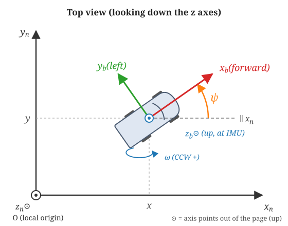
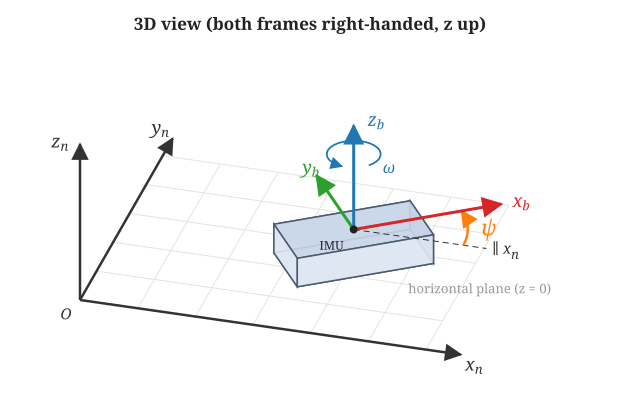

# Coordinate frames

This note defines the two coordinate frames used by the planar IMU/GNSS EKF
(`ekf.py`, `simulator.py`), the yaw angle $\psi$ that relates them, and which
frame each state, input, and measurement is expressed in. The process model
built on top of these definitions is derived in [`dynamics.md`](dynamics.md).

The figures are generated by
[`misc/make_coordinate_figures.py`](../misc/make_coordinate_figures.py)
(`uv run python imu_gnss_ekf_training/misc/make_coordinate_figures.py`).

## 1. Navigation (local) frame $n$ — $(x_n, y_n, z_n)$

- A fixed, local, flat-earth frame. Its origin $O$ is the local reference
  point. In `simulator.py` the vehicle starts at $O$ with $\psi = 0$.
- $x_n$ and $y_n$ span the horizontal plane. $z_n$ points **up**, and the
  frame is **right-handed** ($z_n = x_n \times y_n$).
- The code does not name the axes, but the conventional choice is **ENU**
  (local tangent plane): $x_n$ = East, $y_n$ = North, $z_n$ = Up.
  Real GNSS fixes (latitude/longitude) must be converted to this local
  $x, y$ frame before they are passed to the filter.
- Position $(x, y)$, velocity $(v_x, v_y)$, and GNSS measurements are all
  expressed in this frame.

## 2. Body (car) frame $b$ — $(x_b, y_b, z_b)$

Attached to the vehicle, with its origin at the IMU. It is right-handed with
the **FLU** convention:

| Axis  | Direction                     | IMU channel (CSV column)      |
|-------|-------------------------------|-------------------------------|
| $x_b$ | **forward** (vehicle nose)    | $a_x^m$ (`accel_x_mss`)       |
| $y_b$ | **left**                      | $a_y^m$ (`accel_y_mss`)       |
| $z_b$ | **up**                        | $\omega^m$ (`gyro_z_rads`)    |

- $a_x^m$ is longitudinal acceleration: positive when speeding up.
- $a_y^m$ is lateral acceleration: positive toward the left. In a left turn
  the centripetal acceleration $v\,\omega$ is positive. This is exactly what
  `truth_inputs_demo2` produces during its half-circle turn
  (`accel_y = cruise_speed * omega`, `yaw_rate = omega > 0`).
- $\omega^m$ is the rotation rate about $z_b$. By the right-hand rule it is
  positive **counter-clockwise when seen from above**, which means a left turn.
- The accelerometer biases $b_{ax}, b_{ay}$ are in the body frame, because
  they belong to the sensor axes. The gyro bias $b_g$ is about $z_b$.

## 3. Yaw angle $\psi$

$\psi$ is the angle **from $x_n$ to $x_b$**, measured about $z$ (up) and
positive **counter-clockwise**. It is wrapped to $[-\pi, \pi)$ after every
predict/update step (`np.arctan2(sin, cos)` in `ekf.py`).

- $\psi = 0$: the car faces $+x_n$ (East with ENU).
- $\psi = +\pi/2$: the car faces $+y_n$ (North with ENU).

> **Not a compass heading.** Compass heading $h$ is measured from North,
> positive clockwise. With ENU axes, $\psi = \pi/2 - h$
> (e.g. heading 90° = East gives $\psi = 0$).

## 4. Rotation from body to navigation frame

Because $\psi$ rotates $x_n$ onto $x_b$ about the shared vertical axis, a
body-frame vector is expressed in the navigation frame by

$$
\begin{bmatrix} a_{x_n} \\ a_{y_n} \end{bmatrix}
= R(\psi) \begin{bmatrix} a_{x_b} \\ a_{y_b} \end{bmatrix},
\qquad
R(\psi) =
\begin{bmatrix}
\cos\psi & -\sin\psi \\
\sin\psi & \cos\psi
\end{bmatrix}
$$

(`rotation_matrix` in `ekf.py` / `simulator.py`). The columns of $R(\psi)$
are the body axes written in navigation coordinates:
$x_b = [\cos\psi,\ \sin\psi]^T$ and $y_b = [-\sin\psi,\ \cos\psi]^T$.
The reverse direction (navigation to body) is $R(\psi)^T$.

## 5. Where each quantity lives

| Quantity                                | Symbol                      | Frame        |
|-----------------------------------------|-----------------------------|--------------|
| Position (state `IDX_X`, `IDX_Y`)       | $x, y$                      | $n$          |
| Velocity (state `IDX_VX`, `IDX_VY`)     | $v_x, v_y$                  | $n$          |
| Yaw (state `IDX_YAW`)                   | $\psi$                      | $b$ relative to $n$ |
| Accelerometer bias (`IDX_BAX`, `IDX_BAY`) | $b_{ax}, b_{ay}$          | $b$          |
| Gyro bias (`IDX_BG`)                    | $b_g$                       | about $z_b$  |
| IMU acceleration input                  | $a_x^m, a_y^m$              | $b$          |
| IMU yaw-rate input                      | $\omega^m$                  | about $z_b$ ($= z_n$) |
| GNSS position / velocity measurement    | $x, y, v_x, v_y$            | $n$          |

Note that $v_x, v_y$ are **not** forward and lateral speed. Forward speed is
the first component of $R(\psi)^T [v_x, v_y]^T$.

## 6. The planar assumption and $z$

The filter is 2D. It assumes the vehicle stays level (roll = pitch = 0), so:

- $z_b$ is always parallel to $z_n$. The only rotation between the frames is
  $\psi$, and the gyro's $z$ axis measures $\dot\psi$ directly
  ($\dot\psi = \omega^m - b_g$).
- Height and vertical velocity are not estimated.
- Gravity acts only along $-z$, so it does not appear in $a_x^m, a_y^m$ and
  no gravity compensation is needed. On a slope, gravity would leak into the
  horizontal accelerometer channels and look like accelerometer bias.

The $z$ axes are shown in the figures to fix handedness and the sign of
$\psi$ and $\omega$, not because $z$ is estimated.
