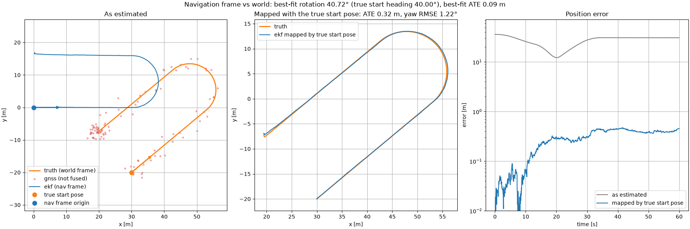
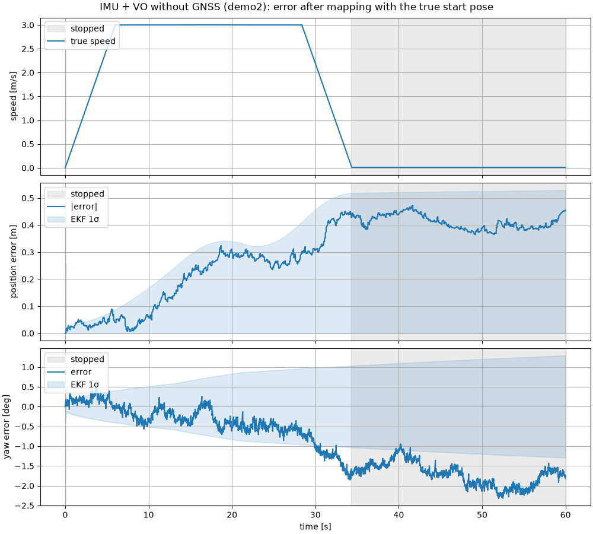
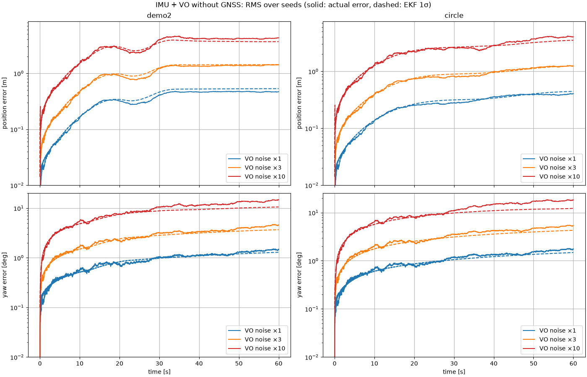

# Navigation with IMU + visual odometry, without GNSS

This note records one IMU + VO run with GNSS switched off and explains its error
behaviour. It then repeats the run with noisier VO. The VO model, the EKF
(stochastic cloning) and the frame alignment are described in
[visual_odometry.md](visual_odometry.md) (§6 and §8).

Everything here is generated by
[`misc/analyze_vo_only.py`](../misc/analyze_vo_only.py), which takes about 4 minutes:

```bash
uv run python -m imu_gnss_ekf_training.misc.analyze_vo_only            # 20 Monte Carlo seeds
uv run python -m imu_gnss_ekf_training.misc.analyze_vo_only --seeds 50
```

## 1. The reference run

```bash
uv run python -m imu_gnss_ekf_training.demo --scenario demo2 --dt 0.01 \
  --use-vo --no-gnss-update --initial-pose 30 -20 40
```

| item | value |
|---|---|
| trajectory | `demo2`: accelerate to 3 m/s, 30 m straight, half circle (R = 8 m), straight back, stop at 34.4 s; 60 s total |
| true start pose | (30, −20) m, heading 40° in the world frame |
| IMU | 100 Hz, default noise; true gyro bias 0.86 deg/s at t = 0 with a random walk of 0.14 deg/s/√s |
| VO | 10 fps, default noise: 5 mm + 1 % of distance, 0.05° + 1 % of rotation per frame |
| GNSS | simulated (0.5 s, 15 % dropout) but **not fused** |
| EKF start | (0, 0), heading 0, 1σ 0.01 m / 0.1° (the navigation frame is the start pose); velocity 0 ± 2 m/s; gyro bias 0 ± 2.9 deg/s |
| seed | 7 |

The EKF estimates the trajectory in its own frame, which is the true start pose.
Seen in the world frame, its trajectory is rotated by the start heading (40°) and
shifted by the start position:

| mapping from the navigation frame to the world | rotation | translation | position RMSE |
|---|---|---|---|
| true start pose | 40.00° | (30.00, −20.00) m | 0.32 m (yaw RMSE 1.22°) |
| least-squares best fit (aligned ATE) | 40.72° | (30.13, −20.24) m | 0.09 m |
| none | | | ≈ 30 m |



*Left: the estimate in its own frame (blue, starting at the origin and heading along
+x) and the truth in the world (orange). The GNSS fixes are shown for reference only.
Middle: the estimate mapped with the true start pose. Right: position error before and
after the mapping.*

The best fit leaves less error than the true start pose. It is free to choose the
rotation, so it absorbs part of the heading drift, here 0.72°.

## 2. Why the position error stops growing

After mapping with the true start pose, the position error grows until about
t = 34 s and then stays at about 0.4 m. Dead-reckoning error should grow without
limit, but it grows with **motion**, not with time:



*Top: true speed. Middle and bottom: position and yaw error (blue) with the EKF's
1σ (shaded). Gray: the vehicle is stopped.*

| t [s] | speed [m/s] | travelled [m] | from start [m] | position error / 1σ [m] | yaw error / 1σ [deg] |
|---|---|---|---|---|---|
| 0 | 0.00 | 0.0 | 0.0 | 0.00 / 0.01 | +0.00 / 0.10 |
| 8 | 3.00 | 15.0 | 15.0 | 0.02 / 0.12 | −0.17 / 0.46 |
| 16 | 3.01 | 39.0 | 37.5 | 0.23 / 0.31 | +0.01 / 0.69 |
| 24 | 3.00 | 63.0 | 27.4 | 0.27 / 0.33 | −0.48 / 0.90 |
| 32 | 1.19 | 83.8 | 16.2 | 0.42 / 0.50 | −1.24 / 1.00 |
| 36 | 0.01 | 85.2 | 16.2 | 0.39 / 0.52 | −1.50 / 1.05 |
| 48 | 0.01 | 85.3 | 16.3 | 0.39 / 0.53 | −2.04 / 1.18 |
| 60 | 0.01 | 85.5 | 16.5 | 0.46 / 0.53 | −1.82 / 1.29 |

Three effects explain the plateau:

1. **Position error comes from motion.** Each VO delta adds translation noise in
   proportion to the distance moved, plus a 5 mm floor. A heading error $\delta\psi$
   turns every later displacement $\Delta\mathbf{p}$ into a position error of about
   $\delta\psi\,\lvert\Delta\mathbf{p}\rvert$. Once the vehicle stops at 34.4 s,
   neither effect adds anything, and the position error and its σ stop growing.
2. **Heading error keeps growing when stopped.** The per-frame yaw floor (0.05°) acts
   on every frame, so yaw σ grows from 1.05° to 1.29° between 36 s and 60 s even
   though the vehicle does not move. The error stays harmless while the vehicle is
   stopped, but it would rotate the next displacement.
3. **Out-and-back motion partly undoes heading error.** A heading error made at
   point A rotates the later path about A. As the vehicle drives back towards A, that
   part of the error shrinks. The dip around t = 20–24 s, after the half circle, comes
   from this.

(The true speed after stopping is 0.01 m/s rather than 0, and about 0.3 m is travelled
in the last 25 s. `demo2`'s acceleration phase boundaries do not fall exactly on the
10 ms sample grid, so acceleration and deceleration do not cancel exactly. The same
issue was fixed in `forward_back` by rounding its boundaries.)

In short, the error grows with distance travelled and with how far the path carries
a heading error. Time alone adds only heading error.

## 3. Noisier VO

All four VO noise parameters are scaled by 3 and by 10, so ×10 means 5 cm + 10 % of
distance and 0.5° + 10 % of rotation per frame. Each setting is run with 20 seeds on
`demo2` and on `circle` (2 m/s on a 10 m radius, never stopping). "VO DR" chains the
noisy VO deltas from the true start pose without the IMU or the EKF.



*RMS over 20 seeds. Solid: actual error. Dashed: the EKF's 1σ.*

RMS over 20 seeds at t = 60 s. The position and yaw columns show EKF error / EKF 1σ.
"Fit rotation error" is the best-fit rotation minus the true start heading.

| scenario | VO noise | position [m] | VO DR position [m] | yaw [deg] | VO DR yaw [deg] | fit rotation error [deg] |
|---|---|---|---|---|---|---|
| demo2 | ×1 | 0.47 / 0.53 | 0.48 | 1.46 / 1.29 | 1.41 | 0.74 |
| demo2 | ×3 | 1.42 / 1.43 | 1.45 | 4.58 / 3.68 | 4.24 | 2.27 |
| demo2 | ×10 | 4.30 / 3.67 | 4.85 | 14.79 / 10.54 | 14.13 | 7.33 |
| circle | ×1 | 0.41 / 0.44 | 0.39 | 1.73 / 1.48 | 1.67 | 0.94 |
| circle | ×3 | 1.24 / 1.25 | 1.18 | 5.37 / 4.28 | 5.00 | 2.92 |
| circle | ×10 | 4.04 / 3.52 | 3.91 | 18.33 / 12.21 | 16.65 | 10.04 |

- **Error scales with the VO noise.** ×3 noise gives about 3× the position and yaw error,
  and ×10 gives about 9–10×. With ×10 VO, a 60 s drive ends about 4 m and 15° off.
- **`circle` keeps growing, `demo2` levels off.** `circle` never stops, so its errors
  keep rising to the end. Because it stays within 20 m of the start, heading error
  moves its position less than a straight drive of the same length would.
- **The EKF is no better than VO alone.** EKF and VO DR errors are within about 10 % of
  each other in every row, even though at ×10 the gyro's per-frame yaw noise (about
  0.09°) is much smaller than VO's (0.5°). See §4.
- **The best-fit rotation absorbs about half the final heading drift.** With noisy VO,
  the aligned ATE underestimates how wrong the heading really is.
- **Yaw σ is too small.** Position σ matches the actual error, but the yaw error is
  about 1.1× (×1) to 1.5× (×10) the EKF's yaw 1σ. The cause has not been
  investigated. Candidates are the estimate-linearization effect described in
  [visual_odometry.md §7](visual_odometry.md#7-results-and-a-known-limitation)
  and the gyro-bias modelling.

## 4. Why the IMU adds little: the gyro bias

The gyro can hold heading between VO frames only if the filter knows its bias. Here
the EKF starts with bias 0 ± 2.9 deg/s, while the true bias is 0.86 deg/s and follows
a random walk of 0.14 deg/s/√s, which amounts to about 1.1 deg/s of drift over 60 s.
The only source of bias information is VO heading, so the gyro-integrated heading ends
up no better than VO heading. `demo2`, VO noise ×10, 20 seeds:

| gyro bias walk [deg/s/√s] | initial gyro bias in EKF | position [m] | yaw [deg] |
|---|---|---|---|
| 0.1432 (default) | unknown (0, 1σ 2.9 deg/s) | 4.30 / 3.67 | 14.79 / 10.54 |
| 0.1432 (default) | known (1σ 0.01 deg/s) | 3.71 / 3.44 | 12.56 / 9.94 |
| 0.0057 | unknown (0, 1σ 2.9 deg/s) | 3.85 / 3.14 | 15.24 / 10.45 |
| 0.0057 | known (1σ 0.01 deg/s) | 2.09 / 2.37 | 2.84 / 2.60 |

The heading improves 5× (15° → 2.8°) only when the bias is **both** known at the start
**and** steady. Knowing the start value does not help if the bias then wanders at the
default rate. A steadier bias does not help if its value must first be learned from
noisy VO. With a good gyro that is calibrated at standstill before driving, IMU + VO
beats VO alone clearly. With the simulator's default gyro, it does not.
