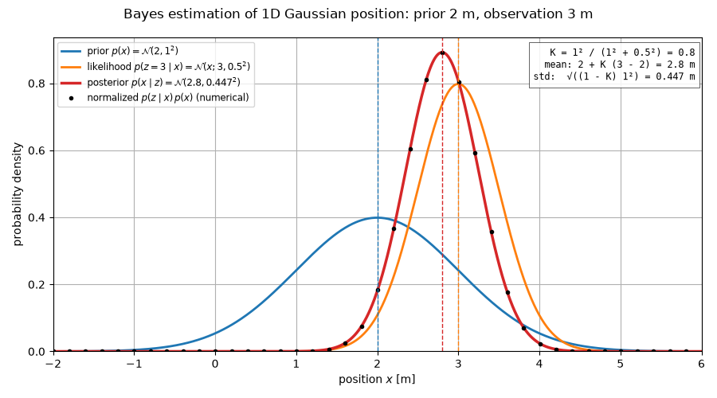
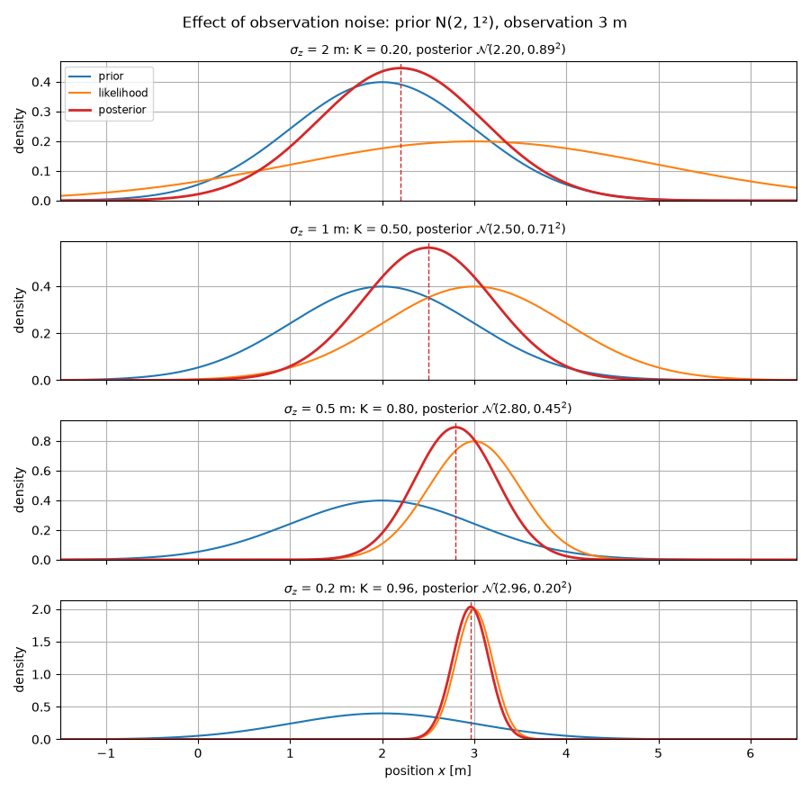

# Bayes estimation of a 1D Gaussian position

This explains the core of the Kalman filter's measurement update using the simplest possible case:
a scalar position $x$ with a Gaussian prior and one noisy observation.
The figures are generated by [`bayes_gaussian_1d.py`](../bayes_gaussian_1d.py).

## Setup

- **Prior.** Before observing, we believe the position is around $\mu_0$ with uncertainty $\sigma_0$:
  $$p(x) = \mathcal{N}(x;\ \mu_0,\ \sigma_0^2).$$
- **Observation model.** A sensor measures the position with additive Gaussian noise:
  $$z = x + w, \qquad w \sim \mathcal{N}(0,\ \sigma_z^2).$$
  For a fixed observed value $z$, the **likelihood** as a function of $x$ is
  $$p(z \mid x) = \mathcal{N}(z;\ x,\ \sigma_z^2) = \frac{1}{\sqrt{2\pi}\,\sigma_z}\exp\!\left(-\frac{(z-x)^2}{2\sigma_z^2}\right).$$
  Because this is symmetric in $x$ and $z$, it is also $\mathcal{N}(x;\ z,\ \sigma_z^2)$ as a function of $x$: a
  bell curve centered on the observation. (In general a likelihood need not integrate to 1 over $x$; here it happens to.)

Example used in the figures: prior $\mu_0 = 2$ m, $\sigma_0 = 1$ m; observation $z = 3$ m, $\sigma_z = 0.5$ m.

## Bayes' rule

$$
p(x \mid z) = \frac{p(z \mid x)\,p(x)}{p(z)} \ \propto\ p(z \mid x)\,p(x).
$$

$p(z) = \int p(z \mid x)\,p(x)\,dx$ does not depend on $x$; it only normalizes the result.

## The posterior is Gaussian

Multiply the two exponents and collect terms in $x$:

$$
-\frac{(x-\mu_0)^2}{2\sigma_0^2} - \frac{(z-x)^2}{2\sigma_z^2}
= -\frac{1}{2}\left(\frac{1}{\sigma_0^2} + \frac{1}{\sigma_z^2}\right)x^2
  + \left(\frac{\mu_0}{\sigma_0^2} + \frac{z}{\sigma_z^2}\right)x + \text{const}.
$$

A quadratic in $x$ in the exponent is a Gaussian. Completing the square gives
$p(x \mid z) = \mathcal{N}(x;\ \mu_1,\ \sigma_1^2)$ with

$$
\boxed{\frac{1}{\sigma_1^2} = \frac{1}{\sigma_0^2} + \frac{1}{\sigma_z^2}}, \qquad
\boxed{\mu_1 = \sigma_1^2\left(\frac{\mu_0}{\sigma_0^2} + \frac{z}{\sigma_z^2}\right)}.
$$

- **Precisions add.** Precision is $1/\sigma^2$, so the posterior is always narrower than both the prior and
  the likelihood.
- **The mean is a precision-weighted average** of the prior mean and the observation. It lies between them,
  closer to whichever is more certain.

For the example: $1/\sigma_1^2 = 1/1 + 1/0.25 = 5$, so $\sigma_1^2 = 0.2$ ($\sigma_1 \approx 0.447$ m), and
$\mu_1 = 0.2\,(2/1 + 3/0.25) = 2.8$ m.



The black dots are $p(z \mid x)\,p(x)$ evaluated on a grid and normalized numerically. They lie on the
closed-form posterior, which checks the formulas above.

## Same result in Kalman filter form

Rewrite the posterior with the **Kalman gain** $K$:

$$
K = \frac{\sigma_0^2}{\sigma_0^2 + \sigma_z^2}, \qquad
\mu_1 = \mu_0 + K\,(z - \mu_0), \qquad
\sigma_1^2 = (1 - K)\,\sigma_0^2.
$$

(Check: $\sigma_1^2 = \sigma_0^2\sigma_z^2/(\sigma_0^2+\sigma_z^2) = 1/(1/\sigma_0^2 + 1/\sigma_z^2)$, and
$\mu_0 + K(z-\mu_0) = (\sigma_z^2\mu_0 + \sigma_0^2 z)/(\sigma_0^2+\sigma_z^2)$, which equals the
precision-weighted mean.)

This is exactly the Kalman filter measurement update with state $x$, prior covariance $P = \sigma_0^2$,
observation matrix $H = 1$ and measurement noise $R = \sigma_z^2$:

| 1D Bayes | Kalman filter |
|---|---|
| $\mu_0,\ \sigma_0^2$ (prior) | $\hat{x}^-,\ P^-$ (predicted state and covariance) |
| $z - \mu_0$ | innovation $y = z - H\hat{x}^-$ |
| $\sigma_0^2 + \sigma_z^2$ | innovation covariance $S = HP^-H^\top + R$ |
| $K = \sigma_0^2 / (\sigma_0^2 + \sigma_z^2)$ | $K = P^-H^\top S^{-1}$ |
| $\mu_1 = \mu_0 + K(z-\mu_0)$ | $\hat{x}^+ = \hat{x}^- + K y$ |
| $\sigma_1^2 = (1-K)\sigma_0^2$ | $P^+ = (I - KH)P^-$ |

The innovation covariance $S$ is also the variance of the evidence: $p(z) = \mathcal{N}(z;\ \mu_0,\ \sigma_0^2 + \sigma_z^2)$.

For the example: $K = 1/(1+0.25) = 0.8$, $\mu_1 = 2 + 0.8\,(3-2) = 2.8$ m, $\sigma_1^2 = 0.2 \cdot 1 = 0.2$ m².

## Effect of the observation noise

$K$ runs from 0 to 1 and says how much to trust the observation relative to the prior:

- $\sigma_z \gg \sigma_0$: $K \to 0$. The observation is ignored and the posterior stays at the prior.
- $\sigma_z \ll \sigma_0$: $K \to 1$. The posterior moves to the observation with variance close to $\sigma_z^2$.



## Running the script

Run from the repo root (it writes the two PNGs into the current directory; see [`linear_kf/README.md`](../../README.md)):

```bash
uv run python -m linear_kf.bayes_1d.bayes_gaussian_1d
uv run python -m linear_kf.bayes_1d.bayes_gaussian_1d --prior-mean 2 --prior-std 1 --obs 3 --obs-std 0.5 --sweep-obs-std 2 1 0.5 0.2
```

The figures in this directory were made with the defaults, running from here:
`cd linear_kf/bayes_1d/doc && PYTHONPATH=../../.. uv run python -m linear_kf.bayes_1d.bayes_gaussian_1d`.
