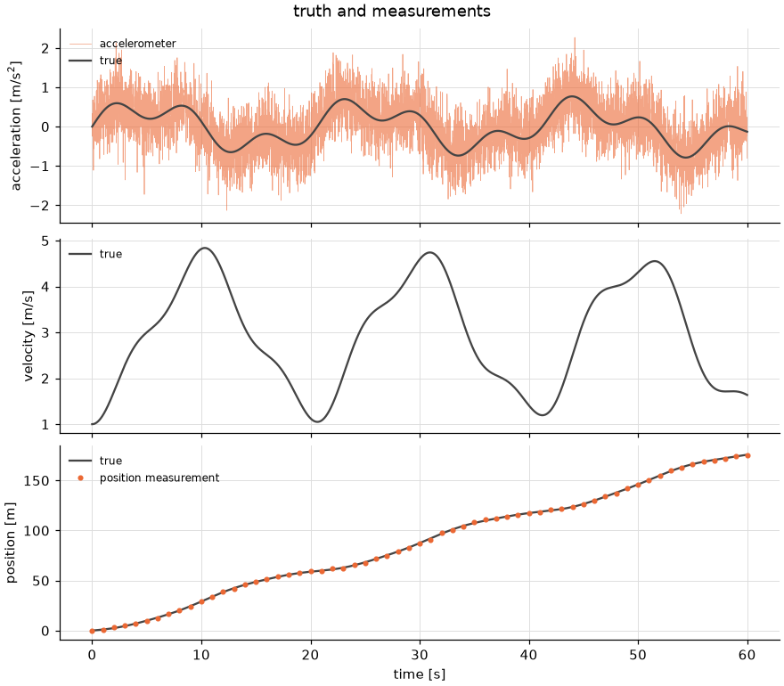
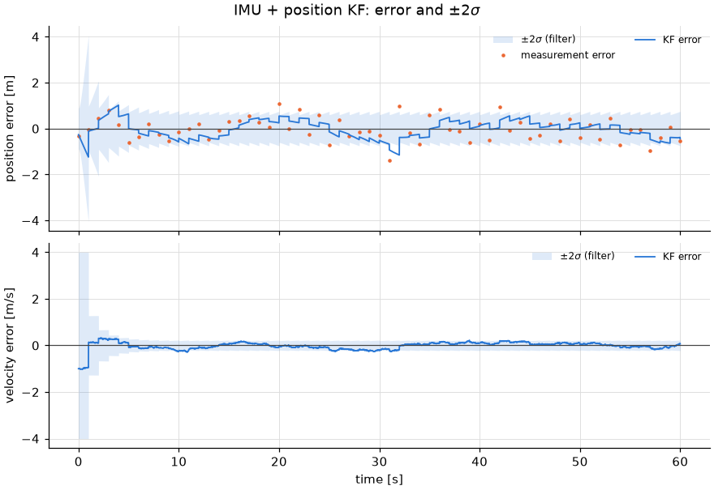
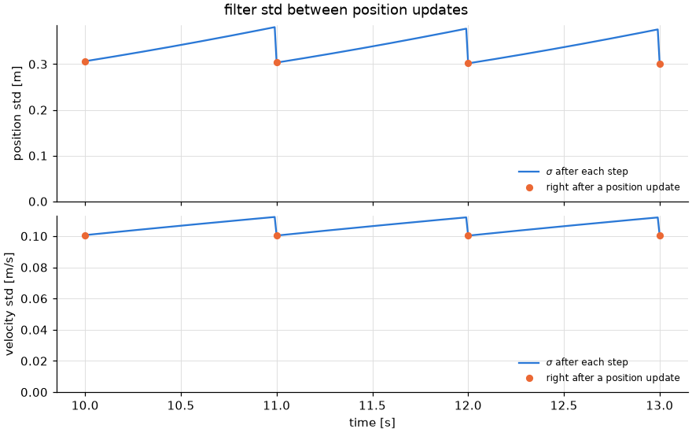
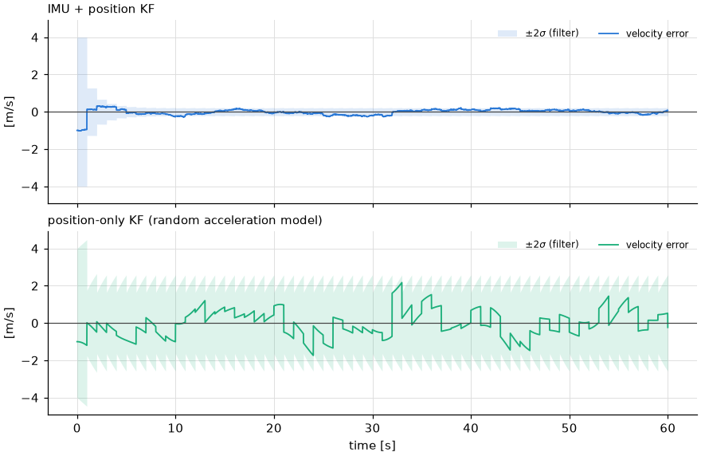
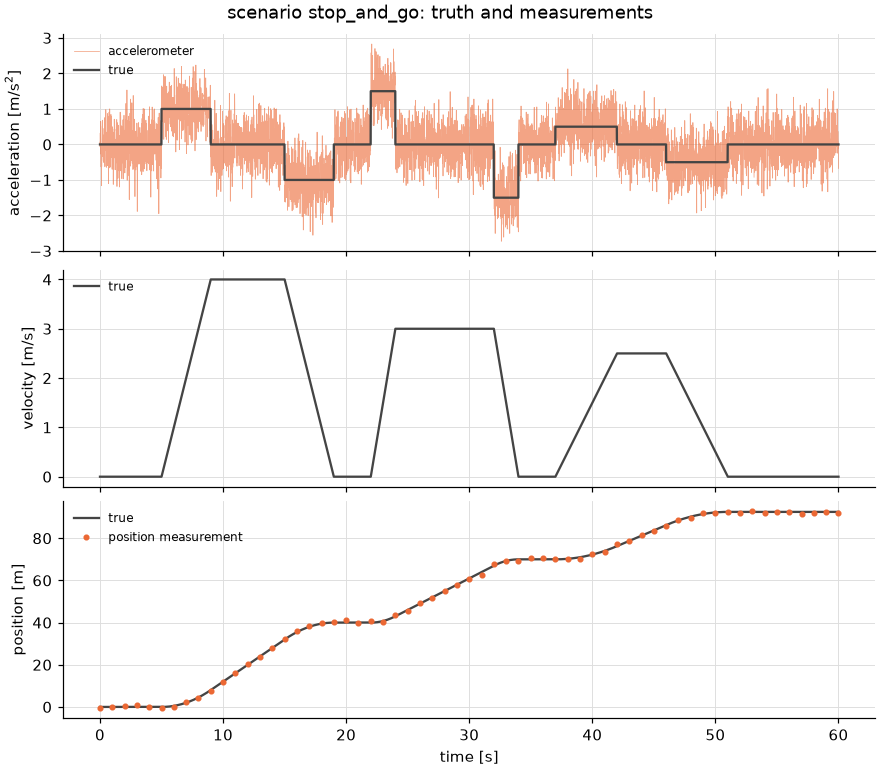
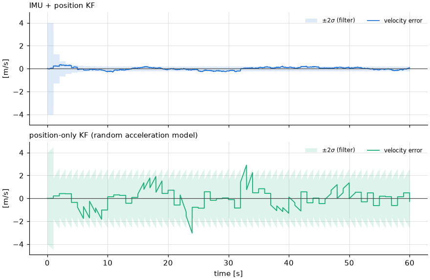
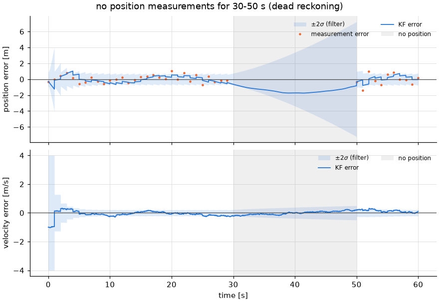
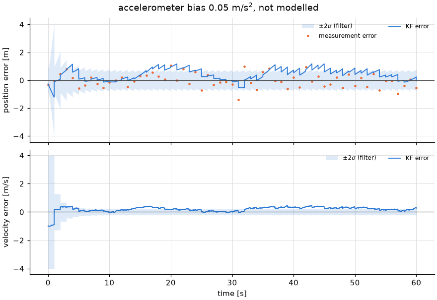
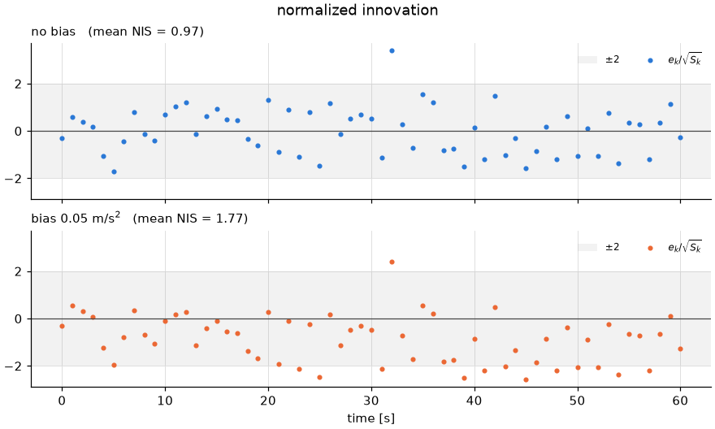

# 1D Kalman filter with an accelerometer (IMU) and position measurements

This document explains the 1D IMU + position Kalman filter in
[`linear_kf/imu_1d/`](..). A vehicle moves along a line. An accelerometer
measures its acceleration at 100 Hz, and a position sensor (think of a 1D GNSS)
measures its position at 1 Hz. The filter estimates position and velocity.

It builds on [`linear_kf/doc/kf_basics.md`](../../doc/kf_basics.md), which derives
the KF on a position-only model. The difference here is that the accelerometer
drives the prediction as a known **input**, instead of acceleration being
treated as unknown noise. This is the 1D version of what
[`imu_gnss_ekf_training/`](../../../imu_gnss_ekf_training/README.md) does in 2D.

| File | Contents |
|---|---|
| [`simulator.py`](../simulator.py) | `SimConfig`, `simulate`: truth trajectory, accelerometer and position measurements |
| [`kf.py`](../kf.py) | `KalmanFilterImu1d` (`predict`/`update`), `run_filter`, and the position-only baseline `run_position_only_filter` |
| [`plotting.py`](../plotting.py) | figure builders |
| [`demo.py`](../demo.py) | CLI: simulate, filter, plot, print RMSE and NIS |
| [`make_doc_figures.py`](../make_doc_figures.py) | regenerates every figure and table in this document |
| [`animate.py`](../animate.py) | movie: the position density spreading in predict and shrinking in each update (§3) |

```bash
# from the repository root
uv run python -m linear_kf.imu_1d.demo                     # writes outputs/linear_kf/imu_1d/*.png
uv run python -m linear_kf.imu_1d.demo --scenario stop_and_go   # scenarios: sine (default), stationary, stop_and_go
uv run python -m linear_kf.imu_1d.demo --outage 30 50 --accel-bias 0.05 --output-dir outputs/imu_1d_bias
uv run python -m linear_kf.imu_1d.make_doc_figures         # rewrites the PNGs in this directory and prints the table in section 5
uv run python -m linear_kf.imu_1d.animate                  # writes outputs/linear_kf/imu_1d/kf_imu1d_anim.mp4 and kf_imu1d_anim_error.png
uv run pytest tests/linear_kf/test_imu_1d.py
```

Unlike the older scripts in `linear_kf/`, every module here is import-safe
(work happens under `if __name__ == "__main__":`), and the demo writes into
`--output-dir`, not the current directory.

## 1. Model

### 1.1 State and input

The state is position and velocity, and the accelerometer reading $a^m_k$ is
the input:

$$
\mathbf{x} = \begin{bmatrix} p \\ v \end{bmatrix}, \qquad
a^m_k = a_k + b + n_k, \qquad n_k \sim \mathcal{N}(0, \sigma_d^2),
$$

where $a_k$ is the true acceleration, $b$ is an accelerometer bias (zero unless
stated; the 2-state filter does not model it, see section 8), and $n_k$ is white
noise with per-sample std $\sigma_d$.

Why an input and not a measurement? The accelerometer measures acceleration,
which is not in the state. You could add $a$ to the state and treat $a^m$ as a
measurement of it (the constant-acceleration model of
[`simple/kf_pva3d.py`](../../simple/kf_pva3d.py)). But then you would need a
process model for how $a$ changes, which you do not know. Using $a^m$ as the
input avoids that: the motion model is just kinematics, and the only
uncertainty is the sensor noise, which the datasheet gives. This is how
inertial navigation is usually done (the IMU "mechanization" drives the
prediction, and the other sensors correct it).

### 1.2 Discretization

Over one IMU step $\Delta t$ the filter holds $a^m_k$ constant (zero-order hold) and integrates exactly:

$$
p_{k+1} = p_k + v_k\,\Delta t + \tfrac12 a^m_k\,\Delta t^2, \qquad
v_{k+1} = v_k + a^m_k\,\Delta t,
$$

that is,

$$
\mathbf{x}_{k+1} = F\,\mathbf{x}_k + B\,a^m_k, \qquad
F = \begin{bmatrix} 1 & \Delta t \\ 0 & 1 \end{bmatrix}, \qquad
B = \begin{bmatrix} \Delta t^2/2 \\ \Delta t \end{bmatrix}.
$$

`transition(dt)` in `kf.py` returns `(F, B)`.

### 1.3 Process noise $Q$

Substituting $a^m_k = a_k + n_k$ (with $b = 0$), the true state obeys
$\mathbf{x}_{k+1} = F\mathbf{x}_k + B a^m_k - B n_k$. So the error the filter
cannot predict in one step is $-B n_k$, and its covariance is

$$
Q = \sigma_d^2\, B B^T = \sigma_d^2 \begin{bmatrix} \Delta t^4/4 & \Delta t^3/2 \\ \Delta t^3/2 & \Delta t^2 \end{bmatrix}.
$$

This is `KalmanFilterImu1d.Q`. It has rank 1 because a single scalar noise
moves both $p$ and $v$, fully correlated.

**Noise density.** Accelerometer datasheets give a noise density $N_a$ in
$\mathrm{m/s^2/\sqrt{Hz}}$, and the per-sample std depends on the sample rate:
$\sigma_d = N_a / \sqrt{\Delta t}$ (`SimConfig.accel_noise_std`). The default
$N_a = 0.05$ at 100 Hz gives $\sigma_d = 0.5\ \mathrm{m/s^2}$, which is the
fuzz in the top panel of Fig. 1. With $q = N_a^2$,

$$
Q = q \begin{bmatrix} \Delta t^3/4 & \Delta t^2/2 \\ \Delta t^2/2 & \Delta t \end{bmatrix},
$$

which is the random-acceleration $Q$ of `kf_basics.md` except for $\Delta t^3/4$ in place of $\Delta t^3/3$.
The difference comes from the noise being held constant over the step here, versus continuously white there.
The velocity variance $q\,\Delta t$ per step is the same, so over many steps
both give a velocity random walk with $\mathrm{Var}[v] = q\,t$ and
$\mathrm{Var}[p] \approx q\,t^3/3$ (see
[`process_noise.md`](../../process_noise_sim/doc/process_noise.md) Model 1).
The velocity random walk is what limits dead reckoning (section 7).

### 1.4 Measurement

$$
y_k = H\mathbf{x}_k + w_k, \qquad H = \begin{bmatrix} 1 & 0 \end{bmatrix}, \qquad w_k \sim \mathcal{N}(0, \sigma_p^2), \qquad R = \sigma_p^2 .
$$

It is available every `imu_rate / pos_rate` = 100 IMU samples, and never during an outage.

## 2. Simulator

`simulate(config, rng)` produces everything at the IMU rate (`SimResult`):

1. True acceleration from the selected scenario (`SimConfig.scenario`, table
   below), sampled at the IMU times.
2. Truth $p$, $v$ integrated from that acceleration **with the same
   zero-order-hold step as the filter**, starting from $p_0$ = `initial_position`
   and the scenario's initial velocity.
   So the filter's motion model is exact, and any inconsistency in the results
   comes from noise and bias, not discretization error.
3. Accelerometer: $a^m_k = a_k + b + n_k$.
4. Position: $y_k = p_k + w_k$ at every `pos_decimation`-th sample, `NaN` elsewhere and during `pos_outage`.

| `scenario` | True acceleration | $v_0$ |
|---|---|---|
| `sine` (default) | $0.5\sin(2\pi t/20) + 0.3\sin(2\pi t/7)$ m/s², smooth speed changes, always moving (Fig. 1) | 1 m/s |
| `stationary` | 0: at rest the whole time | 0 |
| `stop_and_go` | piecewise constant (`STOP_AND_GO_PHASES`): rest 5 s, then three cycles of accelerate / cruise / decelerate / rest (peak 4, 3 and 2.5 m/s), at rest from 51 s on (Fig. 4b) | 0 |

The `stop_and_go` phase boundaries are whole seconds, so they fall on the IMU
sample grid, and each acceleration is cancelled by an equal and opposite one.
The velocity therefore returns to exactly 0 at every stop. To add a scenario, add an
acceleration function and an entry to `SCENARIOS` in `simulator.py`.

The accelerometer noise is drawn before the position noise, so for a fixed
seed, changing only the position settings leaves the accelerometer data unchanged.

| `SimConfig` field | Default | Meaning |
|---|---|---|
| `scenario` | `"sine"` | key of `SCENARIOS` |
| `duration` | 60 s | |
| `imu_rate` | 100 Hz | $1/\Delta t$ |
| `pos_rate` | 1 Hz | must divide `imu_rate` |
| `accel_noise_density` | 0.05 m/s²/√Hz | $N_a$; $\sigma_d = N_a/\sqrt{\Delta t}$ = 0.5 m/s² |
| `accel_bias` | 0 | $b$, not modelled by the filter |
| `pos_noise_std` | 0.5 m | $\sigma_p$ |
| `initial_position`, `initial_velocity` | 0 m, `None` | true initial state; `None` uses the scenario's $v_0$ |
| `pos_outage` | `None` | `(start, end)` seconds without position measurements |

The filter starts from $\hat{\mathbf{x}}_0 = [0, 0]^T$ and
$P_0 = \mathrm{diag}(1^2, 2^2)$ (`demo.X0`, `demo.P0`): it does not know the
initial velocity of 1 m/s in the `sine` scenario.



*Fig. 1: True acceleration and the accelerometer output (top), true velocity
(middle), true position and the 1 Hz position measurements (bottom).*

## 3. The filter loop

`run_filter` uses the same update-then-predict order as `kf_basics.md` §5, at
the IMU rate:

```text
x, P = x0, P0                                  # prior at t_0
for k in 0..N:
    if position available at k:
        x, P = update(x, P, y_k)               # Joseph form, see kf_basics.md §4.3
    store x, P                                 # posterior at t_k
    x, P = predict(x, P, a^m_k, dt)            # prior at t_{k+1}
```

So between position measurements, the filter runs 99 predictions in a row
(dead reckoning with the accelerometer), and every 100th sample it is corrected.
`update` also returns the innovation $e_k = y_k - \hat p_{k|k-1}$ and its
variance $S_k = P_{pp} + \sigma_p^2$. From these, `FilterResult.nis` computes
the normalized innovation squared (NIS) $e_k^2/S_k$, which averages to 1 when
the filter's $Q$ and $R$ match the data.

`animate.py` turns this loop into a movie (20 s of simulation with a 9–15 s
position outage by default). While predicting, the position density widens as
$P \leftarrow FPF^\top + Q$ runs, which is the spreading shown by
`process_noise_sim/animate_process_noise.py`, here starting from a finite
posterior instead of zero. At each fix the movie pauses: the likelihood
$\mathcal N(z, \sigma_p^2)$ fades in, and the prior turns into the posterior,
which is the 1D Bayes update of `bayes_1d/` applied to the position marginal
($K_p = P_{pp}/(P_{pp}+\sigma_p^2)$). The density is drawn over absolute position,
with the true position as a "car" box; the x window follows the car. A second
panel shows the 2σ ellipse in (position, velocity) error. The prediction shears
it, because velocity uncertainty leaks into position, and the update squeezes it
along position. The ±2σ sawtooth over time is saved as a separate image next to
the movie (`kf_imu1d_anim_error.png`).

## 4. Results with the default settings



*Fig. 2: Estimation error (blue) and the filter's own $\pm 2\sigma$ band. The
orange dots in the top panel are the raw position measurement errors.*

- The first update fixes position, but velocity starts wrong by 1 m/s (the
  filter assumed 0). After a few position updates, the velocity is learned from
  how the positions move, and its error settles at about ±0.1 m/s.
- The position error stays inside the band and is smaller than the raw
  measurement errors (RMSE 0.34 m vs 0.5 m).
- The error is a staircase: smooth between updates (accelerometer
  integration), with a jump at each update.



*Fig. 3: Position and velocity std over three update intervals.*

Fig. 3 is the same sawtooth, seen in the covariance. Between updates,
prediction grows the variance. Velocity grows by $q$ per second (from
$0.100^2$ to $0.112^2$ m²/s²). Position grows by $2P_{pv}\,t + P_{vv}\,t^2 + q\,t^3/3$
(from 0.30 m to 0.37 m). Each update brings them back down. The
pattern repeats exactly because the filter has reached steady state (constant
$F$, $Q$, $H$, $R$ and update interval). At steady state the prior before each
update is $P_{pp} = 0.140$, $P_{pv} = 0.031$, so the gain is

$$
K = \frac{1}{P_{pp} + \sigma_p^2}\begin{bmatrix} P_{pp} \\ P_{pv} \end{bmatrix}
= \begin{bmatrix} 0.36 \\ 0.080\ \mathrm{s^{-1}} \end{bmatrix}.
$$

Each update moves position 36 % of the way to the measurement, and changes
velocity by 0.080 m/s per metre of innovation.

## 5. Monte Carlo summary

`make_doc_figures.py` repeats each case over 50 seeds and averages the
metrics over $t \ge 5$ s (initial convergence excluded). "sigma" is the RMS of
the filter's own std over the same samples. A consistent filter has RMSE ≈ sigma and mean NIS ≈ 1.

| case | filter | pos RMSE [m] | pos sigma [m] | vel RMSE [m/s] | vel sigma [m/s] | mean NIS |
|---|---|---|---|---|---|---|
| sine | IMU + position | 0.341 | 0.341 | 0.110 | 0.107 | 0.98 |
| sine | position-only | 0.692 | 0.837 | 0.662 | 1.080 | 0.66 |
| stationary | IMU + position | 0.341 | 0.341 | 0.110 | 0.107 | 0.98 |
| stationary | position-only | 0.619 | 0.837 | 0.443 | 1.080 | 0.50 |
| stop_and_go | IMU + position | 0.341 | 0.341 | 0.110 | 0.107 | 0.98 |
| stop_and_go | position-only | 0.748 | 0.837 | 0.802 | 1.080 | 0.78 |
| sine, outage 30–50 s | IMU + position | 1.212 | 1.253 | 0.156 | 0.148 | 1.00 |
| sine, bias 0.05 m/s² | IMU + position | 0.601 | 0.341 | 0.253 | 0.107 | 1.95 |
| stationary, bias 0.05 m/s² | IMU + position | 0.601 | 0.341 | 0.253 | 0.107 | 1.95 |

The IMU filter is consistent with or without the outage: its error matches its
own uncertainty. The bias case is not, which section 8 explains. The IMU
filter's rows are identical across scenarios, which section 6.1 explains.

## 6. What the accelerometer buys: comparison with a position-only filter

The position-only baseline (`run_position_only_filter`) is the
random-acceleration model of `kf_basics.md`: no input, and $Q$ for white
acceleration with density $\sigma_a$. It sees the same position measurements.



*Fig. 4: Velocity error and $\pm 2\sigma$ of the two filters on the same data.*

Without an accelerometer, the filter has to guess how the velocity changes
between measurements, and $\sigma_a$ is the size of that guess. No single value
fits this trajectory (50 seeds, $t \ge 5$ s):

| $\sigma_a$ [m/s²/√Hz] | pos RMSE [m] | vel RMSE [m/s] | mean NIS |
|---|---|---|---|
| 0.1 | 1.72 | 1.18 | 11.2 |
| 0.3 | 0.84 | 0.79 | 2.28 |
| **1.0** (used in Fig. 4) | 0.69 | 0.66 | 0.66 |
| 3.0 | 0.84 | 0.88 | 0.24 |

Too small, and the filter trusts its constant-velocity prediction too much and
lags behind every speed change (NIS ≫ 1). Too large, and it barely smooths the
measurements. The best RMSE (at 1.0) is still six times the IMU filter's
velocity error, and even there NIS ≠ 1. The true acceleration is smooth and
deterministic, not white noise, so the model cannot be made consistent.

With the accelerometer, the change in velocity is *measured* between position
fixes, so the only thing left to estimate is the slowly wandering integration
error. The velocity is then about 6× more accurate, and the filter's $\sigma$ is honest.

### 6.1 The IMU filter does not care about the trajectory



*Fig. 4b: The `stop_and_go` scenario.*



*Fig. 4c: Same as Fig. 4, for `stop_and_go`.*

In section 5 the IMU filter gives the same numbers for `sine`, `stationary`
and `stop_and_go`, to three digits. This is not a coincidence. Subtract the
truth from the filter equations and the trajectory cancels out. With
$\tilde{\mathbf{x}} = \hat{\mathbf{x}} - \mathbf{x}$,

$$
\tilde{\mathbf{x}}_{k+1} = F\tilde{\mathbf{x}}_k + B\,(n_k + b), \qquad
\tilde{\mathbf{x}}^+_k = (I - K_kH)\,\tilde{\mathbf{x}}_k + K_k w_k .
$$

The error depends only on the noises ($n_k$, $w_k$), the bias $b$ and the initial
error. $P$ and $K$ do not depend on the data at all. So with the same seed,
every scenario sees the same noise and gets the same error. The only
difference is the initial velocity error (1 m/s for `sine`, 0 for the others),
which has decayed by $t = 5$ s. This holds whenever the model is linear and
exact, which is what the zero-order-hold simulator guarantees.

The position-only filter is different. Its prediction assumes constant
velocity, so the true acceleration enters its error as an unmodelled input.
In Fig. 4c its velocity error jumps at every start and stop of an
acceleration phase, and it does worst on `stop_and_go`, which has the most abrupt changes
(vel RMSE 0.80 m/s). It does best on `stationary` (0.44 m/s), where the
constant-velocity assumption is exactly true and its $\sigma_a = 1.0$ is
far too generous (NIS 0.50).

## 7. Dead reckoning: a position outage

With `pos_outage=(30, 50)`, the filter gets no position measurements for 20 s
and runs on the accelerometer alone.



*Fig. 5: Same as Fig. 2, with no position measurements in the shaded interval.*

During the outage the position std grows from 0.37 m to 3.6 m. With no updates,
the covariance just propagates. Over a gap of length $T$, starting from the prior
$P$ at the last update,

$$
\mathrm{Var}[p](T) = P_{pp} + 2P_{pv}\,T + P_{vv}\,T^2 + \tfrac13 q\,T^3,
\qquad \mathrm{Var}[v](T) = P_{vv} + q\,T .
$$

With $P_{pp} = 0.140$, $P_{pv} = 0.031$, $P_{vv} = 0.0125$, $q = 0.05^2$ and
$T = 20$ s, the four terms are 0.14, 1.25, 5.00 and 6.67 m². That gives
$\sigma_p = 3.61$ m, matching the filter to three digits, and
$\sigma_v = \sqrt{0.0125 + 0.05} = 0.25$ m/s.

Two terms dominate:

- $P_{vv}T^2$: the velocity error at the start of the outage, integrated. The
  better the velocity was known when the position measurements stopped, the
  slower the drift.
- $\tfrac13 qT^3$: the accelerometer noise, integrated twice. It grows as
  $T^{3/2}$ in std, so it dominates long outages. A better accelerometer
  (smaller $N_a$) is the only fix.

When position measurements return at 50 s, the first update brings the error
back almost at once. The prior std is large (3.6 m vs $\sigma_p$ = 0.5 m), so
the gain is close to 1.

## 8. An unmodelled accelerometer bias

Real accelerometers have a bias. With `accel_bias=0.05` (about 5 mg), the
filter integrates $a + b$ but still believes its input is unbiased.



*Fig. 6: Same as Fig. 2, with an accelerometer bias of 0.05 m/s².*



*Fig. 7: Normalized innovation $e_k/\sqrt{S_k}$ at each position update,
without and with the bias. For a consistent filter about 95 % of the points lie in ±2.*

- The velocity error no longer averages to zero. It settles around +0.2 m/s,
  outside the $\pm 2\sigma$ band. The filter is confidently wrong.
- The position error is a sawtooth: every second, the bias pushes the predicted
  position ahead and the update pulls it back.
- The innovations are biased negative, so the mean NIS doubles (1.95).

The size of the offset follows from the steady-state gain. Between two updates
($T$ = 1 s), the bias adds $bT$ to the velocity error. At steady state the
update must remove exactly that, and it changes velocity by $K_v e_k$, so the mean innovation is

$$
\bar e = -\frac{b\,T}{K_v} = -\frac{0.05 \times 1}{0.080} = -0.63\ \mathrm{m},
$$

against $-0.60$ m in the simulation. The same fixed point gives a posterior
velocity error of +0.20 m/s and a prior velocity error of +0.25 m/s.

The cure is to estimate the bias: add $b$ to the state,
$\mathbf{x} = [p, v, b]^T$, with $\dot b$ a slow random walk. The position
innovations then have a third place to go, and because a bias produces a
consistent drift, the filter can separate it from white noise. That is the
natural next step for this example. It is what the 8-state
[`imu_gnss_ekf_training`](../../../imu_gnss_ekf_training/README.md) filter does
with `accel_bias_x`, `accel_bias_y` and `gyro_bias` (see its
[`doc/bias_convergence.md`](../../../imu_gnss_ekf_training/doc/bias_convergence.md)).

## 9. Things to try

- `--pos-rate 0.2`: position every 5 s. The sawtooth in Fig. 3 gets taller,
  and the velocity is still well estimated.
- `--accel-noise-density 0.005`: a 10× better accelerometer. Compare the
  outage drift with section 7's formula.
- `--pos-noise-std 5`: a poor position sensor. The IMU then carries most of
  the short-term information.
- `--scenario stationary --accel-bias 0.05`: the vehicle is at rest, yet the
  filter reports a velocity of about 0.2 m/s. Real systems exploit known rest
  periods with a zero-velocity update (ZUPT), a pseudo-measurement $v = 0$.
- Give the filter a wrong $\sigma_d$ or $\sigma_p$ (construct
  `KalmanFilterImu1d` by hand) and watch the mean NIS move away from 1.
