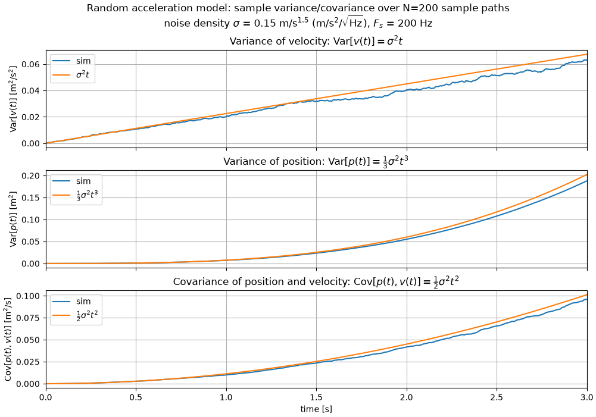
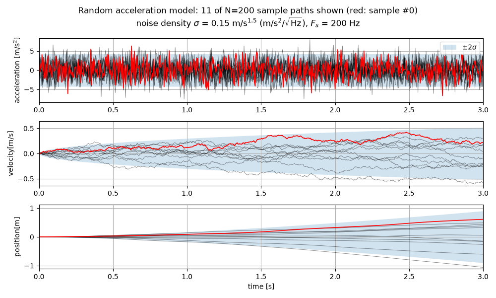
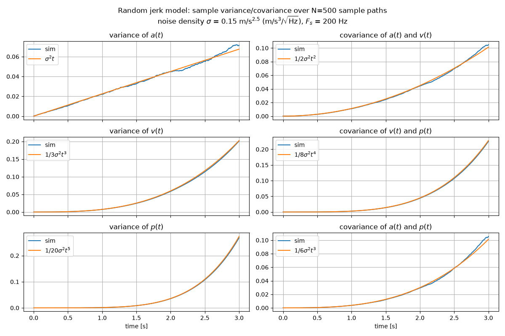
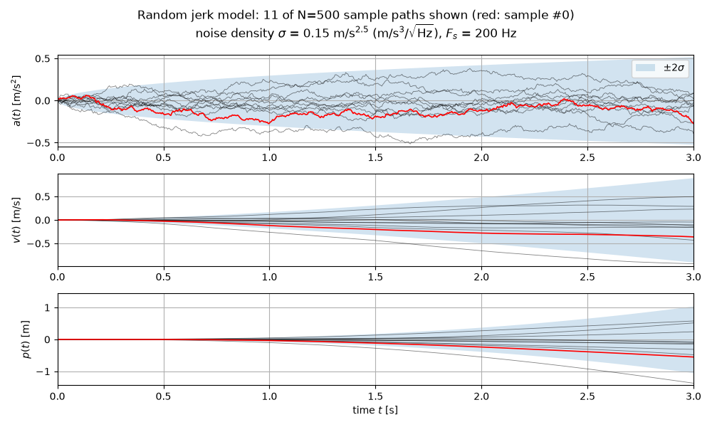

# Random acceleration / random jerk process noise

This documents the noise models simulated in [`process_noise.py`](../process_noise.py) (random
acceleration, 2-state) and [`process_noise2.py`](../process_noise2.py) (random jerk, 3-state), and
the closed-form second-moment formulas that each script overlays on its Monte-Carlo variance/covariance
plots to confirm the simulation is correct.

Both scripts drive a chain of integrators with continuous-time white noise of power spectral density
(PSD) $q = \sigma_0^2$ (`sig0` in the code) and compare $N$ independent sample paths against the
theoretical moments below. The match between simulated and analytic curves in
`vel_sample_var.png` / `model2_cov_sim.png` is the "confirmed by plot matching" referred to here.

The example figures in this directory were produced by running the scripts from here, e.g.
`cd linear_kf/process_noise_sim/doc && PYTHONPATH=../../.. uv run python -m linear_kf.process_noise_sim.process_noise`.
The scripts don't fix a random seed, so a rerun gives different sample paths.

## Discretization convention

Both scripts sample a continuous white-noise process $w(t)$ with $E[w(t)w(s)] = q\,\delta(t-s)$ at
timestep `dt = 1/Fs`. There are two equivalent ways this shows up in the code:

- `process_noise.py`: `_acc = sig0 * randn() / sqrt(dt)` samples $w(t)$ itself (variance $q/dt$, the
  usual band-limited-white-noise discretization), then integrates with `v += _acc * dt`.
- `process_noise2.py`: `_jerk = sig0 * randn() * sqrt(dt)` directly samples the *increment*
  $dW \sim \mathcal{N}(0, q\,dt)$ and adds it straight into the state (`a += _jerk`).

These are the same thing: `_acc * dt = sig0*randn()*sqrt(dt)`, identical in distribution to `_jerk`
above. Both are Euler–Maruyama integration of a driving Wiener process with PSD $q=\sigma_0^2$.

## General result: integrated white noise

For a chain of integrators driven by white noise at the top, with continuous-time state matrix $A$
(shift/nilpotent, i.e. $\dot x = Ax + Gw$, $x(0)=0$) the covariance of $x(t)$ is the classical
Van Loan integral

$$
Q(t) = q \int_0^t \Phi(\tau)\,GG^T\,\Phi(\tau)^T\,d\tau, \qquad \Phi(\tau) = e^{A\tau}.
$$

Both models below are special cases of this with a single noise input $G$ at the highest derivative.
The derivation of this integral, and Van Loan's matrix-exponential method for evaluating it, are in
the [Appendix](#appendix-derivation-of-the-van-loan-integral).

## Model 1 — random acceleration (`process_noise.py`)

State $[p, v]$, acceleration is white noise:

$$
\dot v = w(t), \qquad \dot p = v, \qquad E[w(t)w(s)] = \sigma_0^2\,\delta(t-s).
$$

Here $A=\begin{bmatrix}0&1\\0&0\end{bmatrix}$, $G=\begin{bmatrix}0\\1\end{bmatrix}$, so
$\Phi(\tau)G = [\tau, 1]^T$ and

$$
Q(t) = \sigma_0^2\int_0^t \begin{bmatrix}\tau^2 & \tau\\ \tau & 1\end{bmatrix} d\tau
= \sigma_0^2\begin{bmatrix} t^3/3 & t^2/2 \\ t^2/2 & t \end{bmatrix}.
$$

i.e.

$$
\mathrm{Var}[v(t)] = \sigma_0^2 t, \qquad
\mathrm{Var}[p(t)] = \tfrac{1}{3}\sigma_0^2 t^3, \qquad
E[p(t)v(t)] = \mathrm{Cov}[p(t),v(t)] = \tfrac{1}{2}\sigma_0^2 t^2.
$$

These are exactly the three reference curves plotted in `vel_sample_var.png`
(`sig0**2 * t`, `(1/3)*sig0**2*t**3`, `(1/2)*sig0**2*t**2`).



Sample paths, with the analytic $\pm 2\sigma$ band ($2\sigma_0/\sqrt{\Delta t}$ for the white
acceleration, $2\sqrt{\mathrm{Var}[v(t)]}$ and $2\sqrt{\mathrm{Var}[p(t)]}$ from above):



## Model 2 — random jerk (`process_noise2.py`)

State $[p, v, a]$, jerk is white noise:

$$
\dot a = w(t), \qquad \dot v = a, \qquad \dot p = v, \qquad E[w(t)w(s)] = \sigma_0^2\,\delta(t-s).
$$

Here $A=\begin{bmatrix}0&1&0\\0&0&1\\0&0&0\end{bmatrix}$, $G=\begin{bmatrix}0\\0\\1\end{bmatrix}$,
$\Phi(\tau) = \begin{bmatrix}1&\tau&\tau^2/2\\0&1&\tau\\0&0&1\end{bmatrix}$, so
$\Phi(\tau)G = [\tau^2/2,\ \tau,\ 1]^T$ and

$$
Q(t) = \sigma_0^2\int_0^t
\begin{bmatrix}
\tau^4/4 & \tau^3/2 & \tau^2/2 \\
\tau^3/2 & \tau^2    & \tau     \\
\tau^2/2 & \tau      & 1
\end{bmatrix} d\tau
= \sigma_0^2
\begin{bmatrix}
t^5/20 & t^4/8 & t^3/6 \\
t^4/8  & t^3/3 & t^2/2 \\
t^3/6  & t^2/2 & t
\end{bmatrix},
$$

ordered as $(p, v, a)$. Written out:

$$
\mathrm{Var}[a(t)] = \sigma_0^2 t, \qquad
\mathrm{Var}[v(t)] = \tfrac{1}{3}\sigma_0^2 t^3, \qquad
\mathrm{Var}[p(t)] = \tfrac{1}{20}\sigma_0^2 t^5,
$$

$$
E[a(t)v(t)] = \mathrm{Cov}[a(t),v(t)] = \tfrac{1}{2}\sigma_0^2 t^2, \qquad
E[a(t)p(t)] = \mathrm{Cov}[a(t),p(t)] = \tfrac{1}{6}\sigma_0^2 t^3,
$$

$$
E[p(t)v(t)] = \mathrm{Cov}[p(t),v(t)] = \tfrac{1}{8}\sigma_0^2 t^4.
$$

These six formulas are exactly the reference curves overlaid in `model2_cov_sim.png`
(`sig0**2*t`, `(1/3)*sig0**2*t**3`, `(1/20)*sig0**2*t**5`, `(1/2)*sig0**2*t**2`,
`(1/8)*sig0**2*t**4`, `(1/6)*sig0**2*t**3`), confirmed there by Monte-Carlo sample covariance
over `N=500` simulated paths matching the analytic curves.



Sample paths, with the analytic $\pm 2\sigma$ band from the three variances above:



## Relation between the two models

Model 2's $(v,a)$ block and Model 1's $(p,v)$ block have the *same* form
($t^3/3$, $t^2/2$, $t$) shifted one derivative down — expected, since Model 2 is just Model 1's
integrator chain with one extra integration stage prepended (jerk instead of acceleration as the
white-noise input). Model 1's $Q(t)$ is Model 2's bottom-right $2\times2$ block.

## Appendix: derivation of the Van Loan integral

### A.1 Solution of the linear SDE

Start from the time-invariant linear system driven by zero-mean white noise

$$
\dot x(t) = A x(t) + G w(t), \qquad E[w(t)] = 0, \qquad E[w(t)w(s)^T] = q\,\delta(t-s).
$$

Multiply by the integrating factor $e^{-At}$ and use $\tfrac{d}{dt}e^{-At} = -Ae^{-At}$:

$$
\frac{d}{dt}\left(e^{-At}x(t)\right) = e^{-At}\left(\dot x(t) - A x(t)\right) = e^{-At} G w(t).
$$

Integrating from $0$ to $t$ and multiplying back by $e^{At}$ gives the variation-of-constants solution

$$
x(t) = e^{At}x(0) + \int_0^t e^{A(t-s)} G\, w(s)\, ds .
$$

(Rigorously, $w\,ds$ is the increment $dW(s)$ of a Wiener process with $E[dW\,dW^T] = q\,ds$ and the
integral is an Itô integral; for a deterministic integrand the result below is the same.)

### A.2 Covariance of the state

Take $x(0)$ deterministic (here $x(0)=0$) or at least independent of $w$. Since $E[w]=0$, the mean is
$E[x(t)] = e^{At}E[x(0)]$, and the noise-driven part $\tilde x(t) = \int_0^t e^{A(t-s)}Gw(s)\,ds$ has
second moment

$$
\begin{aligned}
E[\tilde x(t)\tilde x(t)^T]
&= \int_0^t\!\!\int_0^t e^{A(t-s)} G\, E[w(s)w(s')^T]\, G^T e^{A^T(t-s')}\, ds\, ds' \\
&= \int_0^t\!\!\int_0^t e^{A(t-s)} G\, q\,\delta(s-s')\, G^T e^{A^T(t-s')}\, ds\, ds' \\
&= q \int_0^t e^{A(t-s)}\, GG^T\, e^{A^T(t-s)}\, ds .
\end{aligned}
$$

The delta function collapses the double integral to a single one: noise at different instants is
uncorrelated, so only "diagonal" contributions $s=s'$ survive. Substituting $\tau = t-s$
($d\tau = -ds$, limits $s=0\to\tau=t$, $s=t\to\tau=0$):

$$
\boxed{\,Q(t) = q\int_0^t \Phi(\tau)\,GG^T\,\Phi(\tau)^T\, d\tau, \qquad \Phi(\tau) = e^{A\tau}\,}
$$

which is the integral used in the main text. With a random initial state of covariance $P_0$
independent of $w$, the full covariance is $P(t) = \Phi(t)P_0\Phi(t)^T + Q(t)$.

Interpretation: a noise impulse injected at time $s$ enters the state along $G$, then propagates for
the remaining time $\tau=t-s$ through $\Phi(\tau)$. Each impulse contributes
$q\,\Phi(\tau)GG^T\Phi(\tau)^T\,d\tau$, and independent contributions add up.

### A.3 Equivalent differential form (Lyapunov equation)

Differentiating the un-substituted form $Q(t) = q\int_0^t e^{A(t-s)}GG^Te^{A^T(t-s)}ds$ with the
Leibniz rule (the upper limit gives the integrand at $s=t$, i.e. $qGG^T$; differentiating inside
gives $A(\cdot)$ and $(\cdot)A^T$):

$$
\dot Q(t) = A\,Q(t) + Q(t)\,A^T + q\,GG^T, \qquad Q(0) = 0 .
$$

This continuous Lyapunov differential equation is an alternative way to obtain $Q(t)$ and is useful
as a check. For Model 1 it gives $\dot Q_{vv} = q$, $\dot Q_{pv} = Q_{vv}$, $\dot Q_{pp} = 2Q_{pv}$,
which integrates to $qt$, $qt^2/2$, $qt^3/3$ as in the main text.

### A.4 Discrete-time process noise

Applying A.1 over one sample interval $[t_k, t_k+\Delta t]$ gives the exact discrete model

$$
x_{k+1} = F x_k + w_k, \qquad F = e^{A\Delta t}, \qquad
w_k = \int_{t_k}^{t_k+\Delta t} e^{A(t_k+\Delta t - s)} G\, w(s)\, ds .
$$

Because $A$ is time-invariant and $w$ is white, $w_k$ is independent of $x_k$ and of every other
$w_j$, with covariance $E[w_kw_k^T] = Q(\Delta t)$, the same integral evaluated at $t=\Delta t$.
This is the $Q$ a discrete Kalman filter should use. The common shortcut $Q \approx qGG^T\Delta t$
is only the first-order term of $Q(\Delta t)$ for small $\Delta t$; it drops the $\Delta t^3/3$,
$\Delta t^2/2$, … cross terms that couple the integrated states.

The Euler–Maruyama simulation in the scripts corresponds to that first-order step repeated many times.
Its sample covariance converges to the exact $Q(t)$ as `dt → 0`, which is why the plots match.

### A.5 Van Loan's method: computing $F$ and $Q$ with one matrix exponential

When $A$ is not nilpotent (e.g. with damping or Gauss–Markov bias states), the integral in A.2 is
awkward to evaluate by hand. Van Loan (1978) showed that both $F$ and $Q(\Delta t)$ come out of a
single matrix exponential. With $W = q\,GG^T$ and $n = \dim x$, form the $2n\times 2n$ block matrix

$$
M = \begin{bmatrix} -A & W \\ 0 & A^T \end{bmatrix},
\qquad
e^{Mt} = \begin{bmatrix} E_{11}(t) & E_{12}(t) \\ 0 & E_{22}(t) \end{bmatrix}.
$$

Since $M$ is block upper-triangular, so is $e^{Mt}$, and the diagonal blocks are simply
$E_{11}(t) = e^{-At}$ and $E_{22}(t) = e^{A^Tt}$. To find the off-diagonal block, differentiate
$\tfrac{d}{dt}e^{Mt} = M e^{Mt}$ and read off the top-right block:

$$
\dot E_{12}(t) = -A\,E_{12}(t) + W E_{22}(t) = -A\,E_{12}(t) + W e^{A^Tt}, \qquad E_{12}(0) = 0 .
$$

This is a linear ODE of the same form as A.1, with forcing $We^{A^Ts}$, so

$$
E_{12}(t) = \int_0^t e^{-A(t-s)}\, W\, e^{A^Ts}\, ds .
$$

Left-multiplying by $e^{At}$:

$$
e^{At}E_{12}(t) = \int_0^t e^{As}\, W\, e^{A^Ts}\, ds = q\int_0^t \Phi(s)GG^T\Phi(s)^T ds = Q(t).
$$

Therefore, evaluated at $t=\Delta t$:

$$
F = E_{22}(\Delta t)^T, \qquad Q(\Delta t) = F\,E_{12}(\Delta t).
$$

In NumPy/SciPy:

```python
import numpy as np
from scipy.linalg import expm

def van_loan(A, G, q, dt):
    n = A.shape[0]
    M = np.zeros((2 * n, 2 * n))
    M[:n, :n] = -A
    M[:n, n:] = q * G @ G.T
    M[n:, n:] = A.T
    C = expm(M * dt)
    F = C[n:, n:].T
    Q = F @ C[:n, n:]
    return F, Q
```

For Model 2 (`A` = 3×3 shift matrix, `G = [0, 0, 1]^T`), this reproduces the closed-form
$\sigma_0^2\,[t^5/20,\ t^4/8,\ t^3/6;\ \dots]$ matrix above to machine precision.

Reference: C. F. Van Loan, "Computing integrals involving the matrix exponential,"
*IEEE Transactions on Automatic Control*, 23(3), 395–404, 1978.
